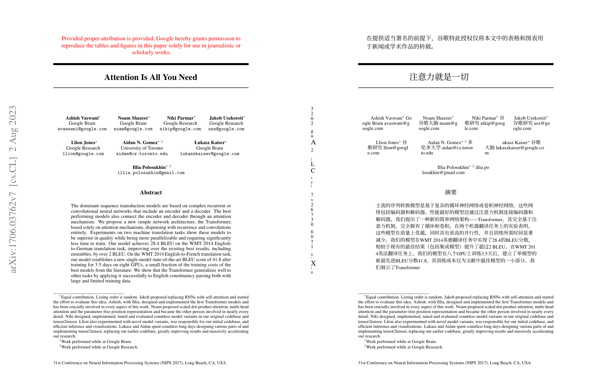

# Full PDF Translate（PDF 全文翻译）

[English](README.en.md) | 简体中文

[](https://www.zotero.org)
[](LICENSE)

在 Zotero 内一键把整篇 PDF 翻译成**保留排版/公式/表格的双语对照 PDF**，使用**你自己的大模型 API Key**（任意 OpenAI 兼容接口），翻译引擎本地运行，不依赖任何付费云服务。

定位：开源自托管的 doc2x / 沉浸式翻译 Pro 替代品。



## 功能

- **右键翻译**：选中条目（或 PDF 附件）→ 右键 →「翻译整篇 PDF」；对整个分类右键可批量翻译，队列顺序执行、进度通知、失败重试
- **doc2x 式左右对照版式**（默认开启）：原文在左、译文在右，并排一页；可切换回引擎原生的上下对照
- **双语 + 译文 PDF**：由 [pdf2zh](https://github.com/PDFMathTranslate/PDFMathTranslate)（内置 BabelDOC 内核）本地生成，版面、公式、表格保留，**默认无水印**
- **自带 Key、多套服务配置**：内置智谱 GLM / DeepSeek / 阿里 Qwen / Kimi / SiliconFlow / OpenAI / Gemini / Ollama 预设，也可填任意 OpenAI 兼容端点；多套配置随时切换，带「测试连接」；API Key 通过环境变量传递，不进命令行
- **预设模式（开箱即用）**：⚡ 快速预览 / 📖 论文精读（自动术语表）/ 🗂 扫描件（OCR 兼容）/ ⚙ 自定义
- **高度自定义**：源/目标语言、页码范围、输出（双语/译文/两者）、QPS 与并发、自定义 System Prompt、术语表 CSV、水印开关、完成后自动打开
- **自动挂回**：翻译完成后自动作为附件挂到原条目下，按「标题.zh.bilingual」命名
- **引擎全自动管理**：首次使用自动下载便携版引擎（约 520 MB，免 Python），直连失败自动切换镜像，支持手动指定已装引擎

## 安装

1. 安装 [Zotero 7](https://www.zotero.org/) 或更高版本（已在 Zotero 10 上验证）
2. 从 [Releases](https://github.com/coderirse/zotero-fulltext-pdf-translate/releases) 下载 `full-pdf-translate.xpi`
3. Zotero → 工具 → 插件 → 齿轮 → Install Plugin From File… → 选择 xpi
4. 编辑 → 设置 → 左侧「PDF 全文翻译」：
   - **服务配置**：新建一个服务（如智谱 GLM），填 API Key 和模型，点「测试连接」，保存
   - **翻译引擎**：点「下载引擎」（仅首次；国内直连 GitHub 失败会自动尝试镜像）
5. 右键条目 →「翻译整篇 PDF（双语）」

> 提示：引擎无法启动多半是缺 VC++ 运行库：https://aka.ms/vs/17/release/vc_redist.x64.exe
> macOS / Linux 请自行 `uv tool install pdf2zh-next` 后在设置中「指定已有 pdf2zh_next.exe」。

## 工作原理

Zotero 7+ 插件（TypeScript）通过 `Subprocess` 启动本地翻译引擎子进程（API Key 走环境变量，不进命令行），产出 mono/dual PDF；开启左右对照时调用引擎自带的 Python + PyMuPDF 把原文页与译文页并排拼版；最后用 `Zotero.Attachments.importFromFile` 挂回条目。

```
src/
  hooks.ts               生命周期 + 自诊断
  modules/
    engine.ts            引擎检测 / 下载（curl+tar，卡死检测+镜像回退）/ 手动指定
    runner.ts            组装引擎命令行并执行、左右拼版、收集输出
    queue.ts             翻译任务队列（顺序执行、进度通知）
    profiles.ts          服务配置、预设服务商、连通性测试
    presets.ts           预设模式参数包
    items.ts             从条目/分类收集 PDF 附件
    attach.ts            结果 PDF 挂载与命名
    menus.ts             右键菜单注册
    prefsUI.ts           偏好页交互
addon/                   manifest / prefs / 偏好页 / 拼版脚本 / 中英文案
```

## 开发

```bash
npm install
npm run build     # 构建 XPI 到 .scaffold/build/
npm start         # 开发模式（复制 .env.example 为 .env 指定 Zotero 路径）
```

自诊断：把高级配置 `extensions.zotero.fullpdf.debugProbe` 设为 `true` 并重启，插件会把设置面板加载全链路报告写到数据目录 `fullpdf-diagnostics.json`，排障时附上该文件即可。

## 实测验证

v0.2.2 起已在真实环境完成端到端验证：Zotero 10.0.3 + Windows 11 + DeepSeek API，单篇 45 页论文成功翻译并生成左右对照 PDF，分类批量翻译正常。

## 故障排查

| 现象                        | 处理                                                                                                                                     |
| --------------------------- | ---------------------------------------------------------------------------------------------------------------------------------------- |
| 引擎无法启动                | 安装 [VC++ 运行库](https://aka.ms/vs/17/release/vc_redist.x64.exe)                                                                       |
| 引擎下载慢 / 卡住           | 已内置镜像自动回退；也可在设置中手动填下载镜像前缀（如 `https://gh-proxy.com/`）                                                         |
| 设置面板点不开              | 把高级配置 `extensions.zotero.fullpdf.debugProbe` 设为 `true` 并重启，数据目录会生成 `fullpdf-diagnostics.json`，提交 issue 时附上该文件 |
| Debug 输出大量 SSE 连接错误 | 来自其他插件（如 doc2x-parse 在重连其桌面客户端），与本插件无关，禁用对应插件即可                                                        |
| 翻译结果仍是上下版式        | 确认已升级到 v0.2.2+ 并**完全重启过 Zotero**——不重启会继续运行旧版本代码                                                                 |

## 已知限制

- Windows 上开箱即用（便携引擎）；其他系统需手动安装引擎并指定路径
- 扫描版 PDF 仅有 OCR 兼容模式兜底，复杂扫描件不如 doc2x 的云端 OCR
- 暂不导出 Word/Markdown（后续可评估接 MinerU 做解析导出）
- 每页约消耗数千 token，批量翻译前建议先用「页码范围」小规模试跑
- 自动下载的引擎为 pdf2zh v1 经典管线（无水印、无术语表）；需要完整功能可 `uv tool install pdf2zh-next` 后手动指定 v2 引擎

## 许可

AGPL-3.0-or-later（与依赖引擎一致）。本插件不分发引擎二进制，仅引导从官方 Release 下载。

致谢：[PDFMathTranslate](https://github.com/PDFMathTranslate/PDFMathTranslate) · [BabelDOC](https://github.com/funstory-ai/BabelDOC) · [zotero-plugin-template](https://github.com/windingwind/zotero-plugin-template)（本插件基于该模板）· 参考实现 [UB-Mannheim/zotero-ocr](https://github.com/UB-Mannheim/zotero-ocr) 与 [guaguastandup/zotero-pdf2zh](https://github.com/guaguastandup/zotero-pdf2zh)。
